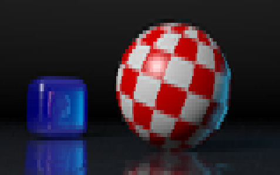

============
UnicodeImage
============

Convert images to Unicode text with ANSI colors

This is a utility whose primary purpose is to display low resolution images in a modern terminal emulator with color and Unicode support. It uses the `Unicode block elements <https://unicode-table.com/en/blocks/block-elements/>`_ to map 2x2 pixel blocks into a single character cell. This enhances the horizontal resolution in comparison to other image to text conversions using the CP437 character set that only split a character cell into upper and lower halves or use text and punctuation to suggest the distribution of pixels mapped into a character cell.

.. image:: doc/images/overview.png

Requirements
------------

This utility requires Python 3, NumPy, and the Pillow image processing library version 9.2 or newer.

Installation
------------

UnicodeImage is a Python 3 program that uses a ``pyproject.toml`` configuration file. It can be installed with ``pip`` or any other program that understands PEP518 pyproject files.

.. code-block:: shell-session

  > git clone https://github.com/kevinpt/UnicodeImage.git
  > cd UnicodeImage
  > sudo pip3 install .

Download
--------

You can access the Git repository from `Github <https://github.com/kevinpt/UnicodeImage>`_.

Usage
-----

After installation, UnicodeImage is invoked from the command line with the ``ui`` program.

.. code-block:: shell-session

  > ui -h

  usage: ui [-h] [-c {2,16,256,16M}] [-w WIDTH] [-b {1x1,1x2,2x2}] [-g] [-i] [--cp437] [-v] file

  positional arguments:
    file                  Image file

  optional arguments:
    -h, --help            show this help message and exit
    -c {2,16,256,16M}, --colors {2,16,256,16M}
                          Set color depth
    -w WIDTH, --width WIDTH
                          Width in chars
    -b {1x1,1x2,2x2}, --block {1x1,1x2,2x2}
                          Block size
    -g, --gray            Grayscale
    -i, --invert          Invert image
    --cp437               Restrict chars to CP437
    -v, --version         show program's version number and exit

The input image file can be any format supported by the Python `Pillow library <https://pillow.readthedocs.io/en/stable/handbook/image-file-formats.html>`_. Output is text that can be redirected to a file if needed.

Block formats
~~~~~~~~~~~~~

There are three pixel block formats available: 2x2, 1x2, and 1x1. These establish how pixels are mapped into a character cell. 2x2 is the default to maximize horizontal resolution. 1x2 splits a cell into only two pixels but they will be closer to square dimensions. 1x1 generates low res output for comparison.

With the 2x2 format there could be from one to four colors in a character cell. The ANSI color encoding only supports a foreground and background color per cell. When there are three or four distinct colors in a cell it is modified to reduce the color count to two. With truecolor (16M) output, a median cut is performed to select two optimal substitute colors. For 16 and 256 color output, two distinct colors in the block are chosen to be foreground and background and the others are reassigned to the closest of the two. This introduces some artifacts but they are generally infrequent enough to not be distracting.

.. code-block:: shell-session

  > ui sphere.png -w 60 -b 2x2

.. image:: doc/images/s60_256_2x2.png

.. code-block:: shell-session

  > ui sphere.png -w 60 -b 1x2

.. image:: doc/images/s60_256_1x2.png

.. code-block:: shell-session

  > ui sphere.png -w 60 -b 1x1

.. image:: doc/images/s60_256_1x1.png

The 2x2 block format is able to improve edge detail and gradients along the X-axis:

.. image:: doc/images/edge_detail.png

Width
~~~~~

You control the size of the generated output with the ``-w, --width`` parameter. It is the number of characters wide the output will be. The number of lines is calculated based on the width and the selected block format. The width is set to match the current terminal size if this option is omitted.

.. code-block:: shell-session

  > ui sphere.png -w 120

.. image:: doc/images/s120_256.png

.. code-block:: shell-session

  > ui sphere.png -w 80

.. image:: doc/images/s80_256.png

.. code-block:: shell-session

  > ui sphere.png -w 50

.. image:: doc/images/s50_256.png

Text encoding
~~~~~~~~~~~~~

The output data is Unicode text in whatever encoding is your Python system default. This will be UTF-8 on most Linux systems. If you use 2x2 blocks with the ``--cp437`` option, 1x2, or 1x1 blocks you will get characters limited to the block symbols available in CP437. Note, however that this does not change the encoding of the output and the escape codes used for the 16-color mode do not suppress bright background colors which isn't supported by traditional PC ANSI output.

Colors
~~~~~~

There are four different color modes supported: 2, 16, 256, and 16M (truecolor). 256-color is the default as it balances image quality with the size of the generated text. With continuous tone images, 16M mode will generally output a new escape code for every character cell leading to approximately 2x larger output data than 256-color.

.. code-block:: shell-session

  > ui sphere.png -w 80 -c 16M

.. code-block:: shell-session

  > ui sphere.png -w 80 -c 256

.. image:: doc/images/s80_256.png

You can invert the input image with ``-i, --invert``. This is primarily useful for the 2-color mode:

================================= ===================================
.. image:: doc/images/s60_2.png   .. image:: doc/images/s60_2_inv.png
================================= ===================================

Licensing
---------

UnicodeImage is licensed for free commercial and non-commercial use under the terms of the MIT
license.

