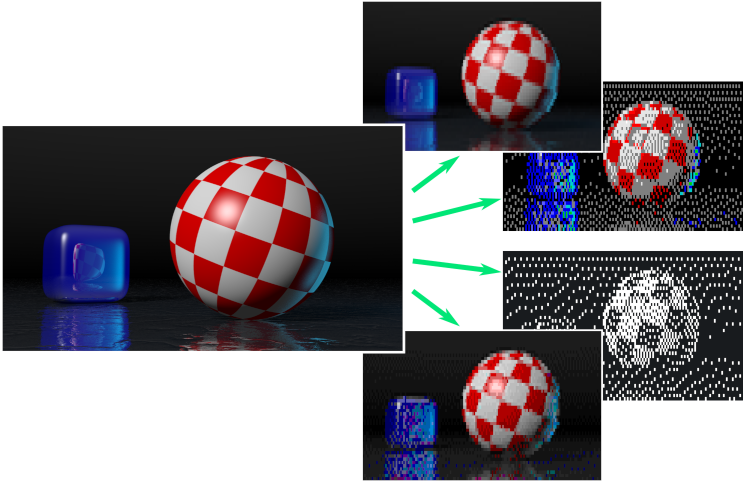
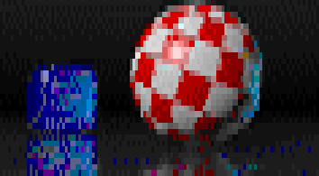
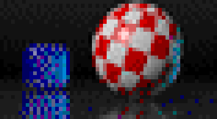
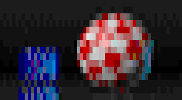
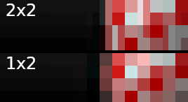
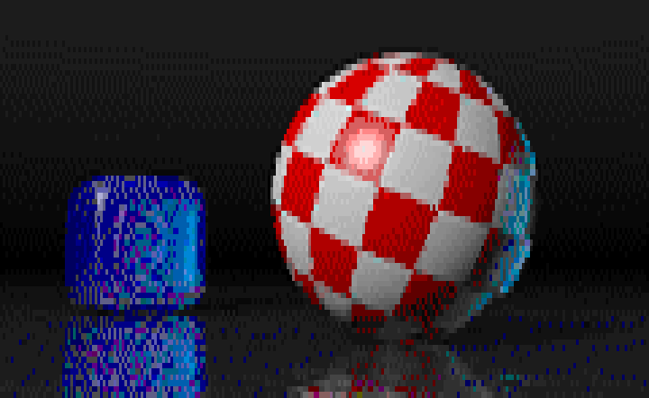
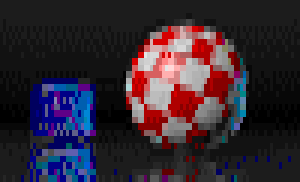

============
UnicodeImage
============

Convert images to Unicode text with ANSI colors

This is a utility whose primary purpose is to display low resolution images in a modern terminal emulator with color and Unicode support. It uses the Unicode block drawing symbols to map 2x2 pixel blocks into a single character cell. This enhances the horizontal resolution in comparison to more traditional image to text conversion that only splits a character cell into upper and lower halves or uses text and punctuation to suggest the distribution of pixels mapped into a character cell.

Requirements
------------

This utility requires either Python 3, numpy, and the Pillow image processing library version 9.2 or newer.

Installation
------------

This package is a Python 3 program that uses a ``pyproject.toml`` configuration file. It can be installed with ``pip`` or any other program that understands PEP518 pyproject files.

.. code-block:: shell-session

  > git clone https://github.com/kevinpt/UnicodeImage.git
  > cd UnicodeImage
  > sudo pip3 install .

Download
--------

You can access the Git repository from `Github <https://github.com/kevinpt/UnicodeImage>`_.

Usage
-----

After installation UnicodeImage is onvoked from the commandline with the `ui` program.

.. code-block:: shell-session

  > ui -h

  usage: ui [-h] [-c {2,16,256,16M}] [-w WIDTH] [-b {1x1,1x2,2x2}] [-g] [-i] [--cp437] [-v] file

  positional arguments:
    file                  Image file

  optional arguments:
    -h, --help            show this help message and exit
    -c {2,16,256,16M}, --colors {2,16,256,16M}
                          Set color depth
    -w WIDTH, --width WIDTH
                          Width in chars
    -b {1x1,1x2,2x2}, --block {1x1,1x2,2x2}
                          Block size
    -g, --gray            Grayscale
    -i, --invert          Invert image
    --cp437               Restrict chars to CP437
    -v, --version         show program's version number and exit

The input image file can be any format supported by the Python Pillow library.

Block formats
~~~~~~~~~~~~~

There are three pixel block formats available: 2x2, 1x2, and 1x1. 2x2 is the default to maximuze horizontal resolution. 1x2 splits a cell into only two pixels but they will be closer to square dimensions. 1x1 generates low res output for comparison.

.. code-block:: shell-session

  > ui sphere.png -w 60 -b 2x2

.. code-block:: shell-session

  > ui sphere.png -w 60 -b 1x2

.. code-block:: shell-session

  > ui sphere.png -w 60 -b 1x1

The 2x2 block format is able to improve edge detail and gradients along the X-axis:

Width
~~~~~

You control the size of the generated output with the ``-w, --width`` parameter. It is the number of characters wide the output will be. The number of lines is calculated based on the width and the selected block format. If this option is omitted the width is set to match the current terminal size.

.. code-block:: shell-session

  > ui sphere.png -w 120

.. code-block:: shell-session

  > ui sphere.png -w 80

.. code-block:: shell-session

  > ui sphere.png -w 50

Text encoding
~~~~~~~~~~~~~

The output of the UnicodeImage is Unicode text in whatever encoding is your python system default. This will be UTF-8 on most Linux systems. If you use 1x2, 1x1 blocks, or 2x2 blocks with the ``--cp437`` option you will get characters limited to the block symbols available in CP437. Note, however that this does not change the encoding of the output and the escape codes used for the 16-color mode do not suppress bright background colors which isn't supported by traditional PC ANSI output.

Colors
~~~~~~
There are four different color modes supported: 2, 16, 256, and 16M (truecolor). 256-color is the default as it balances image quality with the size of the generated text. With continuous tone images 16M mode will generally output a new escape code for every character cell leading to approximately 2x larger output data than 256-color.

You can invert the input image with ``-i, --invert``. This is primarily useful for the 2-color mode.

================================= ===================================
.. image:: doc/images/s80_2.png   .. image:: doc/images/s80_2_inv.png
================================= ===================================

Licensing
---------

UnicodeImage is licensed for free commercial and non-commercial use under the terms of the MIT
license.

